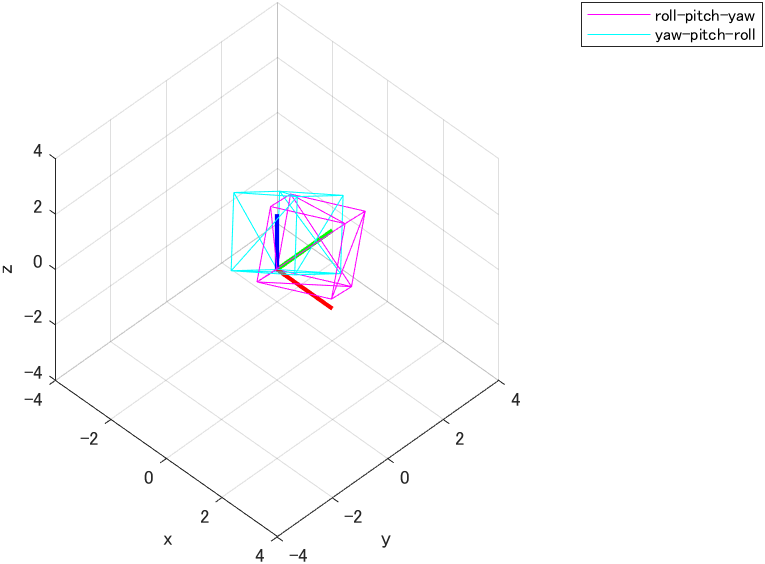
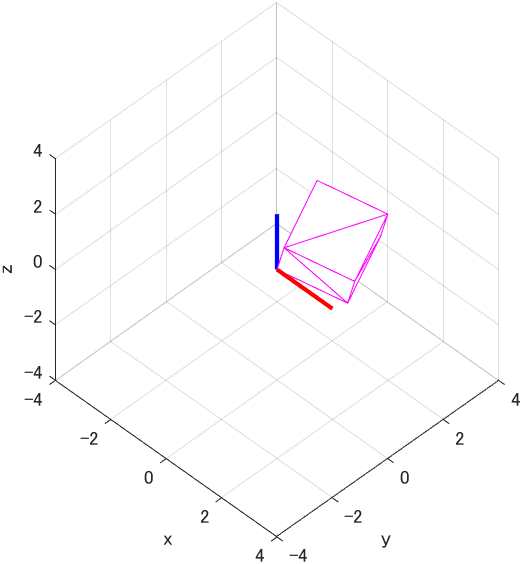
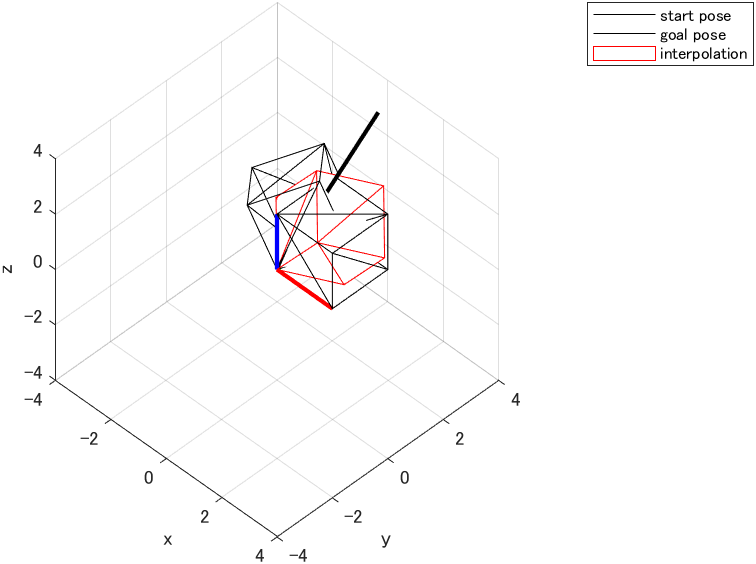

# visualize_Lie_algebra_rotation

## MATLAB live scripts

Rotate a cube STL model with each method.

- *rotate_rpy.mlx*

  Compare the following methods.
  - roll-pitch-yaw $`R_{RPY} := R_z(\psi) R_y(\phi) R_x(\theta)`$
  - yaw-pitch-roll $`R_{YPR} := R_x(\theta) R_y(\phi) R_z(\psi)`$



- *rotate_Lie.mlx*

  Rotate the cube around the specified axis with Lie algebra.



- *linear_interpolate_rotation.mlx*

  Linear interporation of the start and goal poses described by roll-pitch-yaw rotation.



## Subroutines

- *roll.m*, *pitch.m*, and *yaw.m*
  - $`R_x(\theta)`$, $`R_y(\phi)`$, and $`R_z(\psi)`$.

- *wedge3.m* and *vee3.m*
  - $`{[x]}_{\wedge}: \mathbb{R}^3 \to \mathfrak{so}(3)`$ and $`X^{\vee}: \mathfrak{so}(3) \to \mathbb{R}^3`$

```math
\begin{aligned}
{[x]}_{\wedge} &:= \left( \begin{array}{ccc}
0 & -x_3 & x_2 \\
x_3 & 0 & -x_1 \\
-x_2 & x_1 & 0
\end{array} \right) \\
~\\
x &= ({[x]}_{\wedge})^{\vee}
\end{aligned}
```
